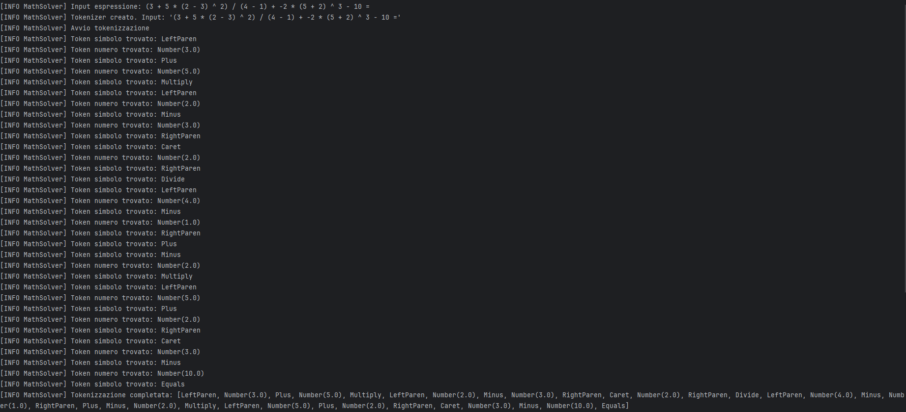
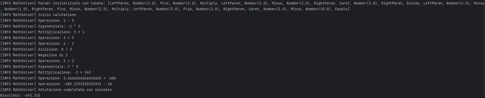

# MathSolver – Aritmetica con Rust e CFG

**MathSolver** è un interprete per espressioni aritmetiche, sviluppato in **Rust**, che utilizza una **grammatica formale (CFG)** per analizzare ed eseguire il calcolo di espressioni matematiche complesse. Supporta numeri reali, potenze, radici, operazioni annidate e moltiplicazione implicita.

---

## Caratteristiche principali

- Linguaggio: **Rust**
- Parsing basato su **CFG** personalizzata
- **Tokenizzazione e parsing separati**
- Supporta:
  - Somma, sottrazione, moltiplicazione, divisione
  - Potenze (`^`) e radici ennesime (`$`)
  - Moltiplicazione implicita: `2(3+4)` o `(1+2)(4-1)`
  - Parentesi annidate e espressioni complesse
- Sistema di **gestione errori avanzato**: divisione per zero, operatori invalidi, parentesi sbilanciate, ecc.

---

## ⚙️ Come funziona

1. **Tokenizzazione**  
   L’espressione viene analizzata e convertita in una sequenza di **token riconosciuti**, come numeri, operatori, parentesi, simboli di potenza o radice.

   

   ```markdown
   Tokenizzazione dell’espressione: `(3 + 5 * (2 - 3) ^ 2) / (4 - 1) + -2 * (5 + 2) ^ 3 - 10 =
   Tokenizzazione completata: [LeftParen, Number(3.0), Plus, Number(5.0), Multiply, LeftParen, Number(2.0), Minus, Nurber(3.0), RightParen, Caret, Number(2.0), RightParen, Divide, LeftParen, Number(4.0), Minus, Number(1.0), RightParen, Plus, Minus, Number(2.0), Multiply, LeftParen, Number(5.0), Plus, Number(2.0), RightParen, Caret, Nunber(3.0), Minus, Number(10.0), Equals]

2. **Parsing con CFG**  
   I token vengono passati a un parser che segue una **grammatica formale (CFG)** per determinare l’ordine corretto delle operazioni e calcolare il risultato.

   

## 📚 Grammatica utilizzata (CFG)

F (Formula): espressione aritmetica completa, che deve terminare con il simbolo "="  
- `(1+3) * 5 - 3 =`

E (Espressione): gestisce somma e sottrazione tra blocchi (+, −), con precedenza minore
- `((1+3) * 5) - 3 =`

P (Prodotto): gestisce moltiplicazione (*), divisione (/) e moltiplicazione implicita
- `2 * 3, 2(3+1), (1+2)(4-1), (2*3) / 6`

U (Unità): gestisce le potenze (^) e le radici ennesime ($), con associatività a destra
- `2^3, 27$3`

B (Base): rappresenta un valore elementare
- Può essere un numero (unsigned number), una negazione (−), o un’espressione tra parentesi

## ❌ Errori gestiti
1. Durante l’esecuzione:
- DivisionByZero
- OverflowError / UnderflowError
- InvalidExponentiation o InvalidRoot
- EvenRootOfNegative
- ExpressionTooComplex (futuro)

2.Durante il parsing/tokenizzazione:
- InvalidNumber
- UnexpectedEnd
- InvalidExpression
- UnmatchedParenthesis
- UnexpectedToken
- InvalidOperator

## Contribuire

Contribuzioni e miglioramenti sono i benvenuti! Apri una pull request per aggiunte, bugfix o nuove funzionalità. Si raccomanda di testare ogni modifica prima dell’invio.

## Licenza

Distribuito con licenza **MIT**. Vedi il file [LICENSE](LICENSE) per maggiori informazioni.

## Contatti

- **Autore**: Simone Siega  
- **Email**: [simonesiega1@gmail.com](mailto:simonesiega1@gmail.com)  
- **GitHub**: [simonesiega](https://github.com/simonesiega)
